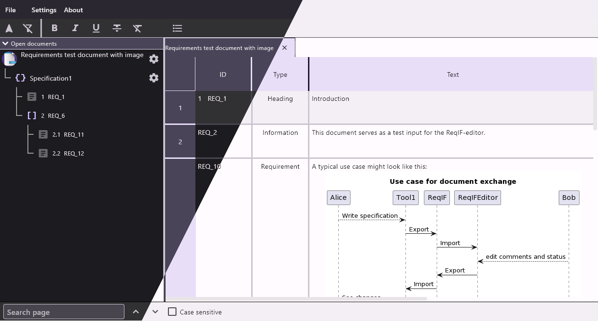

# ReqIf editor

A GUI editor for the [Requirements Interchange Format (ReqIF)](https://www.omg.org/reqif/) built with flutter.

## Getting Started

Download a binary from the releases page, start the app and open one of the examples in the `test/data` directory.

## Assets

The images in the `assets` directory are from the public domain [Blue Bits icon set from icojam](https://web.archive.org/web/20160319191219/http://www.icojam.com/blog/?p=253).

## Localization

This project generates localized messages based on arb files found in
the `lib/src/localization` directory. Currently only English and German are supported.

## License

This application is free software using the BSD-3-Clause License, see `LICENSE` for the full text.
